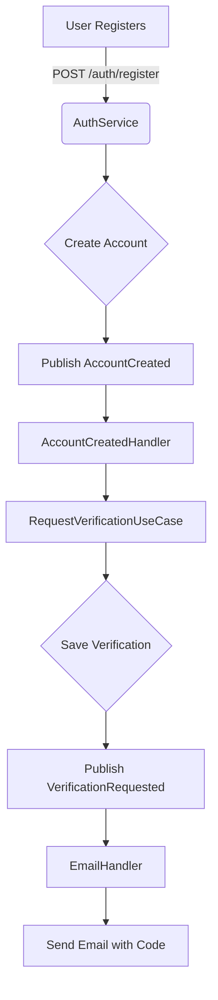
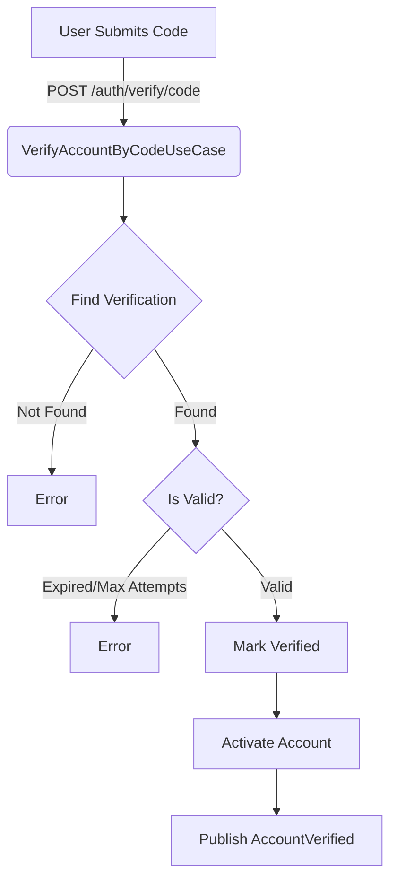

# Email Verification System

This document details the implementation of the Email Verification System within the Identity Context.

## 📋 Overview

The Email Verification System ensures that user accounts are verified before they can fully access the platform. It supports verification via **6-digit codes** sent by email.

### Key Features

*   **Automatic Trigger**: Verification process starts automatically upon user registration.
*   **Code Expiration**: Verification codes are valid for **30 minutes**.
*   **Security**: Maximum of **3 failed attempts** before the code is invalidated.
*   **Resend Capability**: Users can request a new code if the previous one expired or was lost.
*   **Status Tracking**: Accounts track their status (`pending_verification`, `active`, `suspended`).

## 🏗️ Architecture

The system follows the project's DDD and Hexagonal Architecture principles.

### Domain Layer

*   **Aggregate**: `EmailVerification`
    *   Manages the lifecycle of a verification attempt.
    *   Enforces business rules (expiry, attempts).
*   **Entity**: `Account`
    *   Modified to include `status: AccountStatus`.
    *   `isActive` is now derived from `status`.
*   **Value Objects**:
    *   `VerificationCode`: Validates 6-digit format.
    *   `VerificationToken`: Validates UUID format.
    *   `AccountStatus`: Enum (`pending_verification`, `active`, `suspended`).
*   **Events**:
    *   `AccountVerificationRequestedDomainEvent`
    *   `AccountVerifiedDomainEvent`
    *   `VerificationExpiredDomainEvent`

### Application Layer

*   **Use Cases**:
    *   `RequestAccountVerificationUseCase`: Creates verification record and publishes event.
    *   `VerifyAccountByCodeUseCase`: Validates code and activates account.
    *   `ResendVerificationUseCase`: Handles requests for new codes.
*   **Event Handlers**:
    *   `AccountCreatedHandler`: Listens to `AccountCreated` and triggers `RequestAccountVerification`.
    *   `AccountVerificationRequestedEmailHandler`: Listens to `VerificationRequested` and sends the email.

## 🔄 Workflows

### 1. Registration & Verification Flow



### 2. Verification Submission



## 🔌 API Endpoints

### Register
`POST /auth/register`
Creates a new account with status `pending_verification`.

### Verify Code
`POST /auth/verify/code`
Verifies the account using the code received by email.

**Body:**
```json
{
  "email": "user@example.com",
  "code": "123456"
}
```

### Resend Verification
`POST /auth/verification/resend`
Resends the verification code if the account is still pending.

**Body:**
```json
{
  "email": "user@example.com",
  "method": "email_code"
}
```
