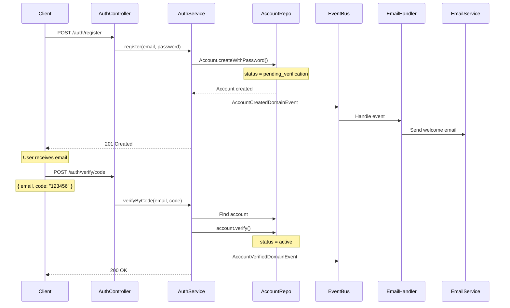
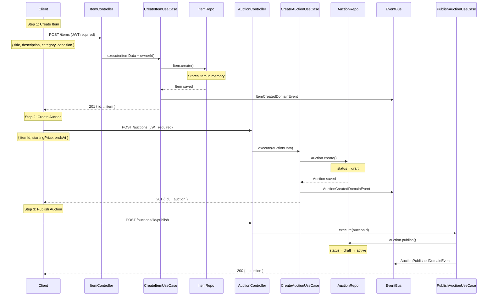
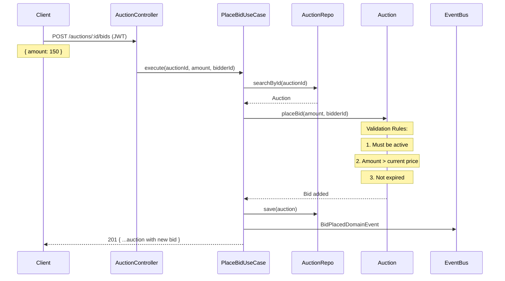
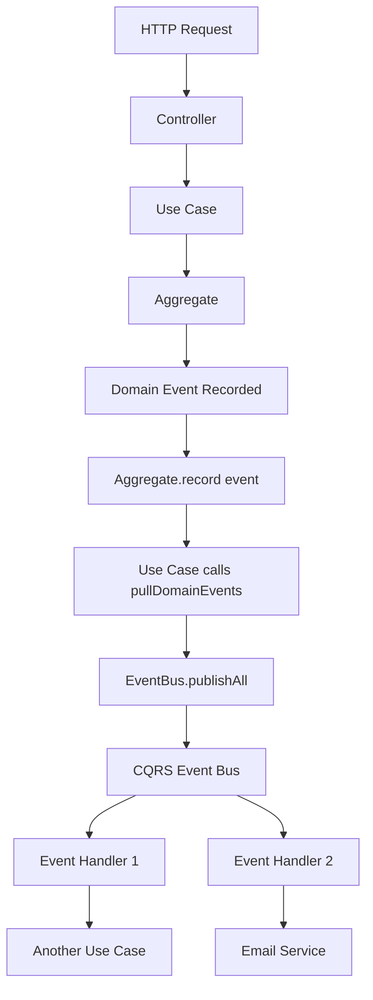

# Internal Flow Documentation

> **Audience:** Developers working on this codebase  
> **Purpose:** Understand how data flows through the system  
> **Last Updated:** December 5, 2025

---

## Table of Contents

1. [Account Registration & Verification Flow](#account-verification-flow)
2. [Auction Creation Flow](#auction-creation-flow)
3. [Bidding Flow](#bidding-flow)
4. [Event Publishing Pattern](#event-publishing-pattern)
5. [Architecture Decision Records](#architecture-decisions)

---

## Account Verification Flow

### Overview
Users must verify their email before they can participate in auctions.

### Step-by-Step Flow



### Code Path

1. **Entry Point:** `AuthController.register()`
   ```typescript
   // File: src/context/identity/infrastructure/http/controller/AuthController.ts
   @Post('register')
   async register(@Body() dto: RegisterDto) {
     await this.authService.register(dto.email, dto.password);
   }
   ```

2. **Business Logic:** `AuthService.register()`
   ```typescript
   // File: src/context/identity/application/service/auth.service.ts
   async register(email: string, password: string) {
     const account = Account.createWithPassword(
       AccountID.random(),
       new Email(email),
       await Password.hash(password),
       AccountStatus.pendingVerification() // ← Key: starts unverified
     );
     
     await this.accountRepository.save(account);
     await this.eventBus.publishAll(account.pullDomainEvents());
     // ↑ Publishes: AccountCreatedDomainEvent
   }
   ```

3. **Domain Event:** `AccountCreatedDomainEvent`
   ```typescript
   // Published from Account.createWithPassword()
   this.record(new AccountCreatedDomainEvent({
     aggregateId: this.id.value,
     email: this.email.value,
     occurredOn: new Date()
   }));
   ```

4. **Event Handler:** `RequestAccountVerificationUseCase`
   ```typescript
   // File: src/context/identity/application/RequestAccountVerificationUseCase.ts
   // Triggered by AccountCreatedDomainEvent
   
   async execute({ accountId }) {
     // Creates EmailVerification aggregate
     const verification = EmailVerification.create(
       EmailVerificationId.random(),
       new AccountID(accountId),
       VerificationCode.generate(), // Random 6 digits
       VerificationMethod.emailCode(),
       new Date(Date.now() + 24 * 60 * 60 * 1000) // 24h expiry
     );
     
     await this.repository.save(verification);
     await this.eventBus.publishAll(verification.pullDomainEvents());
     // ↑ Publishes: AccountVerificationRequestedDomainEvent
   }
   ```

5. **Email Notification:** `AccountVerificationRequestedEmailHandler`
   ```typescript
   // File: src/context/notifier/application/handlers/AccountVerificationRequestedEmailHandler.ts
   
   async handle(event: AccountVerificationRequestedDomainEvent) {
     await this.sendEmailUseCase.execute({
       to: event.email,
       subject: 'Verify your email',
       body: `Your verification code is: ${event.code}`
     });
   }
   ```

### Key Files Involved

| Layer | File | Responsibility |
|-------|------|----------------|
| HTTP | `AuthController.ts` | Receives request |
| Application | `AuthService.ts` | Orchestrates flow |
| Domain | `Account.ts` | Business rules |
| Domain | `EmailVerification.ts` | Verification logic |
| Infrastructure | `InMemoryAccountRepository.ts` | Persistence |
| Application | `RequestAccountVerificationUseCase.ts` | Verification use case |
| Application | `AccountVerificationRequestedEmailHandler.ts` | Email trigger |

---

## Auction Creation Flow

### Overview
Authenticated users can create auctions for their items.

### Step-by-Step Flow



### Code Path

1. **Create Item**
   ```typescript
   // Entry: ItemController
   POST /items
   ↓
   CreateItemUseCase.execute()
   ↓
   Item.create() // Domain logic
   ↓
   itemRepository.save()
   ↓
   eventBus.publish(ItemCreatedDomainEvent)
   ```

2. **Create Auction (Draft)**
   ```typescript
   // Entry: AuctionController
   POST /auctions
   ↓
   CreateAuctionUseCase.execute()
   ↓
   Auction.create() // status = draft
   ↓
   auctionRepository.save()
   ↓
   eventBus.publish(AuctionCreatedDomainEvent)
   ```

3. **Publish Auction (Activate)**
   ```typescript
   // Entry: AuctionController
   POST /auctions/:id/publish
   ↓
   PublishAuctionUseCase.execute()
   ↓
   auction.publish() // Validates: draft → active
   ↓
   auctionRepository.save()
   ↓
   eventBus.publish(AuctionPublishedDomainEvent)
   ```

### Business Rules (in Domain Layer)

```typescript
// File: src/context/auction/domain/Auction.ts

publish(): void {
  // Rule 1: Can only publish draft auctions
  if (!this.status.isDraft()) {
    throw new Error('Can only publish auctions in draft status');
  }
  
  // Rule 2: Must end in the future
  if (this.endsAt <= new Date()) {
    throw new Error('Auction must end in the future');
  }
  
  // Apply state change
  this._status = AuctionStatus.active();
  this.record(new AuctionPublishedDomainEvent(...));
}
```

### Key Files Involved

| Component | File | Purpose |
|-----------|------|---------|
| Controller | `ItemController.ts` | Item HTTP endpoints |
| Controller | `AuctionController.ts` | Auction HTTP endpoints |
| Use Case | `CreateItemUseCase.ts` | Item creation orchestration |
| Use Case | `CreateAuctionUseCase.ts` | Auction creation orchestration |
| Use Case | `PublishAuctionUseCase.ts` | Publish logic |
| Aggregate | `Item.ts` | Item business rules |
| Aggregate | `Auction.ts` | Auction business rules |

---

## Bidding Flow

### Overview
Authenticated users can place bids on active auctions.

### Step-by-Step Flow



### Code Path

```typescript
// 1. Entry Point
POST /auctions/:id/bids
↓
// 2. Use Case
PlaceBidUseCase.execute({ auctionId, amount, bidderId })
↓
// 3. Retrieve Aggregate
const auction = await repository.searchById(auctionId);
↓
// 4. Domain Logic (ALL VALIDATION HERE)
auction.placeBid(new BidAmount(amount), new AccountID(bidderId));
↓
// 5. Persist
await repository.save(auction);
↓
// 6. Publish Event
await eventBus.publishAll(auction.pullDomainEvents());
```

### Domain Validation Rules

```typescript
// File: src/context/auction/domain/Auction.ts

placeBid(amount: BidAmount, bidderId: AccountID): void {
  // Rule 1: Auction must be active
  if (!this.status.isActive()) {
    throw new Error('Auction must be active to place bids');
  }
  
  // Rule 2: Must not be expired
  if (this.isExpired()) {
    throw new Error('Auction has ended');
  }
  
  // Rule 3: Bid must be higher than current price
  const currentPrice = this.getCurrentPrice();
  if (amount.value <= currentPrice.value) {
    throw new Error(`Bid must be higher than ${currentPrice.value}`);
  }
  
  // Valid bid - create and add
  const bid = Bid.create(
    BidId.random(),
    this.id,
    amount,
    bidderId,
    new Date()
  );
  
  this._bids.push(bid);
  this.record(new BidPlacedDomainEvent(...));
}
```

### What Happens to Events?

Currently, `BidPlacedDomainEvent` is published but has **no handlers** yet.

**Future handlers could:**
- Send email to previous highest bidder ("You've been outbid!")
- Broadcast via WebSocket to all auction viewers
- Update analytics/metrics

---

## Event Publishing Pattern

### Who Publishes Events?

**Answer:** Use Cases and Event Handlers publish events.

### Event Flow Architecture



### Example: Complete Event Chain

```typescript
// 1. Domain records event internally
class Account extends AggregateRoot {
  static createWithPassword(...) {
    const account = new Account(...);
    account.record(new AccountCreatedDomainEvent(...)); // ← Recorded
    return account;
  }
}

// 2. Use case publishes events
class AuthService {
  async register() {
    const account = Account.createWithPassword(...);
    await this.repository.save(account);
    await this.eventBus.publishAll(account.pullDomainEvents()); // ← Published
  }
}

// 3. Event handler listens
@EventsHandler(AccountCreatedDomainEvent)
class RequestAccountVerificationUseCase {
  async handle(event: AccountCreatedDomainEvent) {
    // Create verification
    const verification = EmailVerification.create(...);
    await this.repository.save(verification);
    await this.eventBus.publishAll(verification.pullDomainEvents()); // ← Chain continues
  }
}
```

### Event Registry

| Event | Published By | Handled By | Purpose |
|-------|-------------|------------|---------|
| `AccountCreatedDomainEvent` | `AuthService` | `RequestAccountVerificationUseCase` | Trigger email verification |
| `AccountVerificationRequestedDomainEvent` | `RequestAccountVerificationUseCase` | `AccountVerificationRequestedEmailHandler` | Send verification email |
| `AccountVerifiedDomainEvent` | `VerifyAccountByCodeUseCase` | _(none yet)_ | Future: unlock features |
| `ItemCreatedDomainEvent` | `CreateItemUseCase` | _(none yet)_ | Future: analytics |
| `AuctionCreatedDomainEvent` | `CreateAuctionUseCase` | _(none yet)_ | Future: notifications |
| `AuctionPublishedDomainEvent` | `PublishAuctionUseCase` | _(none yet)_ | Future: notify followers |
| `BidPlacedDomainEvent` | `PlaceBidUseCase` | _(none yet)_ | Future: outbid emails, WebSocket |

---

## Architecture Decisions

### Why In-Memory Repositories?

**Decision:** Start with in-memory, migrate to Prisma later.

**Rationale:**
- Faster MVP development
- Easier testing (no DB setup)
- Can swap implementation without changing domain

**Trade-off:** Data lost on restart (acceptable for development)

---

### Why Domain Events?

**Decision:** Use domain events for cross-context communication.

**Rationale:**
- Decouples contexts (Identity doesn't know about Notifier)
- Enables async processing
- Audit trail of what happened

**Example:**
```
Identity Context → AccountCreatedEvent → Notifier Context
```

---

### Why Separate Item and Auction?

**Decision:** `Item` is a separate aggregate from `Auction`.

**Rationale:**
- Items can exist before auction creation
- Items could be reused (re-auction)
- Clear bounded context separation

**Alternative considered:** Item as value object inside Auction (rejected: too coupled)

---

## Common Questions

### Q: How do I add a new endpoint?

**A:** Follow this pattern:

1. **Create DTO** (`infrastructure/http/dto/`)
   ```typescript
   export class MyDto {
     @IsString() field: string;
   }
   ```

2. **Create Use Case** (`application/`)
   ```typescript
   @Injectable()
   export class MyUseCase {
     async execute(params) { ... }
   }
   ```

3. **Add Controller Method** (`infrastructure/http/controller/`)
   ```typescript
   @Post('/my-endpoint')
   async myEndpoint(@Body() dto: MyDto) {
     await this.myUseCase.execute(dto);
   }
   ```

4. **Register in Module** (`*.module.ts`)
   ```typescript
   providers: [MyUseCase]
   ```

---

### Q: How do I add event handling?

**A:**

1. **Create Handler** (`application/handlers/`)
   ```typescript
   @EventsHandler(MyDomainEvent)
   export class MyHandler implements IEventHandler<MyDomainEvent> {
     async handle(event: MyDomainEvent) { ... }
   }
   ```

2. **Register in Module**
   ```typescript
   providers: [MyHandler]
   ```

3. **Events auto-published** when use case calls `eventBus.publishAll()`

---

### Q: Where do business rules go?

**A:** Always in the **Domain Layer** (never in controllers or use cases).

**Bad:**
```typescript
// ❌ Controller validating business rule
if (auction.status !== 'active') {
  throw new Error('...');
}
```

**Good:**
```typescript
// ✅ Domain validating business rule
class Auction {
  placeBid() {
    if (!this.status.isActive()) {
      throw new Error('...');
    }
  }
}
```

---

## Additional Resources

- **Architecture Overview:** `/docs/ARCHITECTURE.md`
- **Testing Guide:** `/docs/TESTING.md`
- **API Documentation:** `http://localhost:8000/docs` (Swagger)
- **Project Status:** `/docs/PROJECT_STATUS.md`

---

**Last Updated:** December 5, 2025  
**Maintainers:** Development Team
