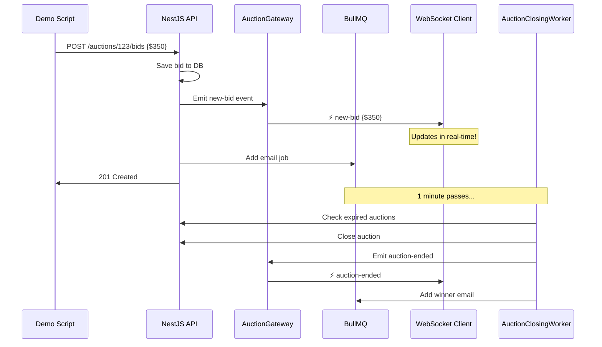

# 🎬 Real-Time Auction Demo

Complete step-by-step demo showing WebSocket + BullMQ in action.

## Quick Start

```bash
# 1. Make sure server is running
pnpm start:dev

# 2. Make sure Redis is running
docker-compose ps

# 3. Run the demo script
./examples/demo-auction.sh
```

---

## What the Demo Does

### Step 1: User Registration (15s)
- Creates user: `demo@auction.com`
- Triggers email verification flow
- **You'll need to:** Copy verification code from server console

### Step 2: Account Verification (5s)
- Verifies the account with the code
- Activates the account

### Step 3: Login (5s)
- Authenticates user
- Receives JWT token for subsequent requests

### Step 4: Create Item (5s)
- Creates "Vintage Camera 📷"
- Category: Electronics
- Condition: Used

### Step 5: Create Auction (5s)
- Creates auction for the camera
- Starting price: $100
- **Duration: 1 minute** (ends automatically)

### Step 6: Publish Auction (5s)
- Changes status from `draft` to `active`
- **Triggers:** `AuctionPublishedEvent`
- **Schedules:** Auto-close job in BullMQ (1 minute delay)

### Step 7: Open WebSocket Client (manual)
- Opens browser with enhanced client
- Shows real-time statistics
- Beautiful visualization of events

### Step 8: Place Bids (20s)
- Places 5 bids automatically:
  - $150
  - $200
  - $250
  - $300
  - $350
- 3-second delay between bids
- **Triggers:** `BidPlacedEvent` for each
- **Broadcasts:** Real-time to WebSocket clients
- **Queues:** Email notification jobs

---

## What You'll See

### In the Terminal
```
🚀 Starting Auction Real-Time Demo
======================================

📝 Step 1: Registering user...
✅ User registered

🔐 Step 2: Verifying account...
Enter the 6-digit verification code from console: 123456
✅ Account verified

🔑 Step 3: Logging in...
✅ Logged in successfully
Token: eyJhbGciOiJIUzI1NiIs...

📦 Step 4: Creating item...
✅ Item created
Item ID: 550e8400-e29b-41d4-a716-446655440000

🎪 Step 5: Creating auction (ends in 1 minute)...
✅ Auction created
Auction ID: 660f9511-f39c-52e5-b827-557766551111
Ends at: 2025-12-05T20:15:00Z

📢 Step 6: Publishing auction...
✅ Auction published and LIVE!

💰 Step 8: Placing bids (watch the WebSocket client!)
Placing bid: $150
✅ Bid placed: $150
👀 Check the WebSocket client for real-time update!

Placing bid: $200
✅ Bid placed: $200
👀 Check the WebSocket client for real-time update!
...
```

### In the WebSocket Client (Browser)


**Features:**
- 🟢 Connection status indicator (pulsing green dot)
- 📊 Live statistics (Total Bids, Current Price, Events)
- 📡 Real-time event feed with animations
- 🎨 Color-coded events:
  - 💰 Green = New Bid
  - 📢 Orange = Auction Published  
  - 🏁 Red = Auction Ended

**Example Event Card:**
```
💰 New Bid Placed                      7:14:35 PM
━━━━━━━━━━━━━━━━━━━━━━━━━━━━━━━━━━━━━━━━
Amount: $350
Bidder ID: 550e8400...
Bid ID: 770f9622...
```

### In Server Console
```
Handling BidPlacedDomainEvent: {
  bidId: '770f9622-g50d-63f6-c938-668877662222',
  amount: 350,
  bidderId: '550e8400-e29b-41d4-a716-446655440000',
  aggregateId: '660f9511-f39c-52e5-b827-557766551111'
}
Emitted new-bid event to auction 660f9511-f39c-52e5-b827-557766551111
Job add-outbid-notification queued in email-notifications
BidPlacedEvent handled: WebSocket emitted + Email job queued
```

---

## Timeline

```
Time    Event                           What Happens
━━━━━━━━━━━━━━━━━━━━━━━━━━━━━━━━━━━━━━━━━━━━━━━━━━━━━━━━━━━━
0:00    Demo starts                     Script begins
0:15    User verified                   Account active
0:20    Item created                    Camera ready
0:25    Auction created                 Draft mode
0:30    Auction published               Goes LIVE ⚡
0:35    Bid #1 ($150)                   WebSocket broadcast 📡
0:38    Bid #2 ($200)                   WebSocket broadcast 📡
0:41    Bid #3 ($250)                   WebSocket broadcast 📡
0:44    Bid #4 ($300)                   WebSocket broadcast 📡
0:47    Bid #5 ($350)                   WebSocket broadcast 📡
1:30    Auction auto-closes             BullMQ worker 🤖
        Winner determined               Email queued 📧
        WebSocket notifies              auction-ended event
```

---

## Architecture in Action



---

## Verification Checklist

After running the demo, verify:

- [ ] WebSocket client shows 5 bid events
- [ ] Statistics update correctly (Bids: 5, Price: $350)
- [ ] Server console shows event handlers
- [ ] BullMQ logs show queued jobs
- [ ] After 1 minute, auction closes automatically
- [ ] Browser receives `auction-ended` event

---

## Troubleshooting

### "Connection refused" in WebSocket client
**Fix:**
```bash
# Make sure server is running
pnpm start:dev
```

### "Cannot resolve verification code"
**Fix:**
Check server console for the 6-digit code:
```
Verification code: 123456
```

### "Auction didn't close after 1 minute"
**Fix:**
Check AuctionClosingWorker logs. You may need to add `close()` method to Auction aggregate.

---

## Next Steps

1. **Add `close()` method** to Auction aggregate
2. **Implement real emails** in EmailNotificationWorker
3. **Add authentication** to WebSocket (validate JWT)
4. **Create Bull Board UI** for queue monitoring
5. **Add integration tests** for the full flow

---

## Clean Up

```bash
# Stop server (Ctrl+C)

# Stop Redis
docker-compose down

# Remove demo user (optional)
# Data is in-memory, so just restart server
```

---

**Demo Created:** December 5, 2025  
**Duration:** ~2 minutes  
**Technologies:** NestJS, Socket.io, BullMQ, Redis
